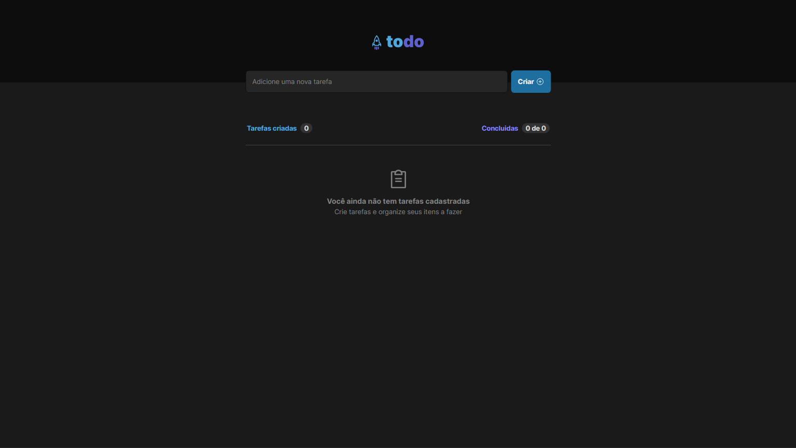
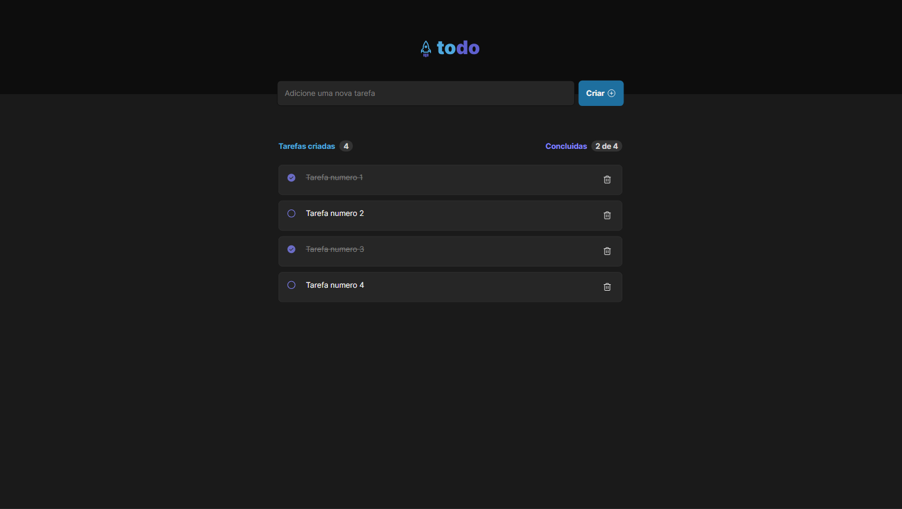

<h1 align="center">
    
</h1>

<p align="center">
  <a href="#about">About</a> •
  <a href="#features">Features</a> •
  <a href="#how-it-works">How to run the application</a> • 
  <a href="#tech-stack">Techs used</a>
</p>

<div align="center"> 
	
</div>

<br>

<div align="center"> 
	
</div>

## About

This project is a todo list made to fulfill the first challenge of [Rocketseat's](https://www.rocketseat.com.br/ignite) 2023 ReactJS course.

---

## Features

- [x] Create new tasks
- [x] mark tasks as completed
- [x] Delete tasks
- [x] Shows task status (how many were created and how many were completed)
- [x] Save tasks list in local storage

---

## How to run the application

You will need to have [Git](https://git-scm.com) and [Node.js](https://nodejs.org/en/) installed to run the project:

#### Running the app

```bash

# Clone this repository
$ git clone https://github.com/Pdro-marqss/ignite-challenge1.git

# Access the project folder in your terminal
$ cd ignite-challenge1

# Install the dependencies
$ npm install

# Run the application in development mode
$ npm run dev

```

---

## Techs used

Tools used in the construction of this project:

- **[React](https://reactjs.org/)**
- **[Vite](https://vitejs.dev/)**
- **[Typescript](https://www.typescriptlang.org/)**
- **[Styled Components](https://styled-components.com/)**
- **[PhosphorIcons](https://phosphoricons.com/)**

---